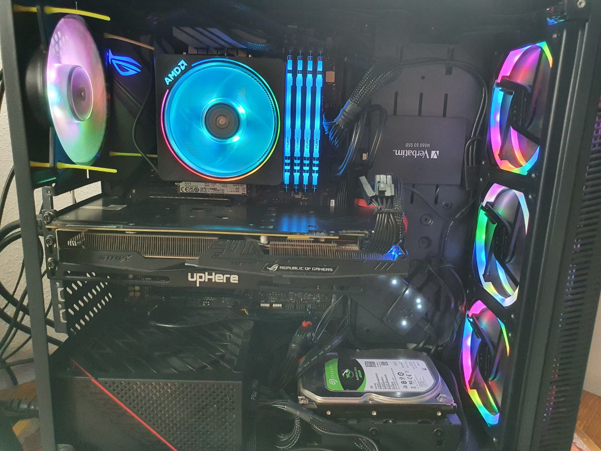
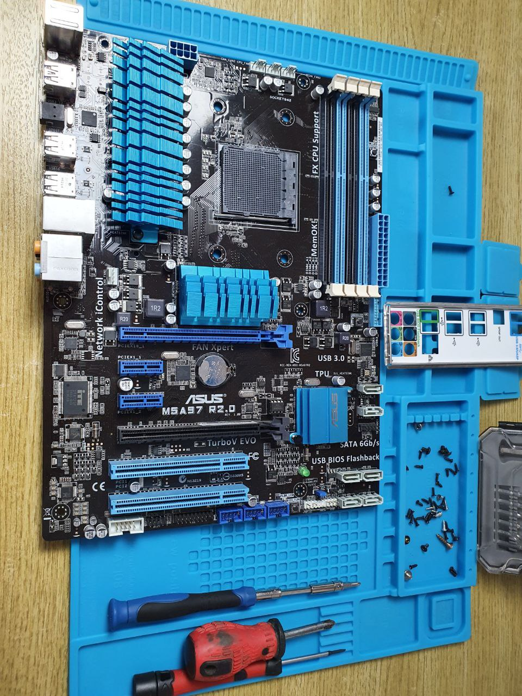

# Assemblaggio PC desktop con allestimento gaming

Scegliamo assieme i componenti migliori per il tuo allestimento per un PC gaming desktop in base alle tue esigenze.
Una volta completata la selezione, provvederò ad ordinare i tuoi componenti a prezzi competitivi.
Provvederò a completare l'intero assemblagggio in modo che tu possa immediatamente iniziare a sfruttare la potenza del tuo nuovo PC.


# Trasforma il tuo vecchio PC in uno come nuovo
Spesso non è necessario comprare un nuovo PC spendendo tanti soldi. Con una spesa molto contenuta, possiamo applicare piccole migliorie a livello hardware/software dai grandi risultati. Non crederai ai tuoi occhi!
Esempi:
 - Aggiornamento sistema operativo
 - Pulizia di sistema
 - Controllo e pulizia virus / malware
 - Selezione ed installazione componenti hardware potenziati

# Riparazioni hardware e software

Il tuo dipartimento IT a portata di click! Mandaci la tua richiesta e verificheremo assieme cosa non va col tuo computer!
Esempi:
 - Sostituzione tastiera
 - Sostituzione alimentatore portatile
 - Riparazione errori di sistema
 - Riparazione installazioni
 - Recupero dati con software dedicati

**[Contattaci oggi stesso, non aspettare!](mailto:giordanoserra7@gmail.com)**


<!--
## Header 2

> This is a blockquote following a header.
>
> When something is important enough, you do it even if the odds are not in your favor.

### Header 3

```js
// Javascript code with syntax highlighting.
var fun = function lang(l) {
  dateformat.i18n = require('./lang/' + l)
  return true;
}
```

```ruby
# Ruby code with syntax highlighting
GitHubPages::Dependencies.gems.each do |gem, version|
  s.add_dependency(gem, "= #{version}")
end
```

#### Header 4

*   This is an unordered list following a header.
*   This is an unordered list following a header.
*   This is an unordered list following a header.

##### Header 5

1.  This is an ordered list following a header.
2.  This is an ordered list following a header.
3.  This is an ordered list following a header.

###### Header 6

| head1        | head two          | three |
|:-------------|:------------------|:------|
| ok           | good swedish fish | nice  |
| out of stock | good and plenty   | nice  |
| ok           | good `oreos`      | hmm   |
| ok           | good `zoute` drop | yumm  |

### There's a horizontal rule below this.

* * *

### Here is an unordered list:

*   Item foo
*   Item bar
*   Item baz
*   Item zip

### And an ordered list:

1.  Item one
1.  Item two
1.  Item three
1.  Item four

### And a nested list:

- level 1 item
  - level 2 item
  - level 2 item
    - level 3 item
    - level 3 item
- level 1 item
  - level 2 item
  - level 2 item
  - level 2 item
- level 1 item
  - level 2 item
  - level 2 item
- level 1 item

### Small image


### Large image


### Definition lists can be used with HTML syntax.

<dl>
<dt>Name</dt>
<dd>Godzilla</dd>
<dt>Born</dt>
<dd>1952</dd>
<dt>Birthplace</dt>
<dd>Japan</dd>
<dt>Color</dt>
<dd>Green</dd>
</dl>

```
Long, single-line code blocks should not wrap. They should horizontally scroll if they are too long. This line should be long enough to demonstrate this.
```

```
The final element.
```
-->
